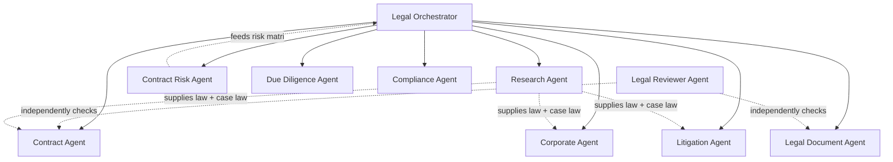

# LEGAL AI BUREAU — Agent Architecture

## 1. Agent graph



The Orchestrator is a router + merger, not a "smartest agent that does everything." It classifies the request, invokes the relevant specialist(s), and is the only component allowed to assemble a `FINAL ANSWER`.

## 2. Reasoning pipeline (brief §8 — every user-facing legal answer goes through this, no shortcuts)

```
USER QUESTION
  → FACT EXTRACTION
  → FACT CLARIFICATION       (only if critical facts are missing — see §3)
  → LEGAL ISSUE IDENTIFICATION
  → JURISDICTION RESOLUTION   (workspace default, or explicit override)
  → APPLICABLE LAW            (Legal Research Agent, via Retrieval — LEGAL-RAG.md)
  → LEGAL RETRIEVAL
  → CASE LAW RETRIEVAL
  → CONTRADICTION CHECK       (conflicting positions across sources/case law)
  → LEGAL REASONING           (task-class REASONING model, see LEGAL-ARCHITECTURE.md §4)
  → RISK ANALYSIS             (Contract/Litigation/Compliance risk agents as applicable)
  → RECOMMENDATION
  → SOURCE VERIFICATION       (Citation Validator — LEGAL-RAG.md §Anti-Hallucination)
  → FINAL ANSWER
```

Implemented as an explicit state machine in `backend/app/agents/orchestrator/pipeline.py` (LangGraph or a hand-rolled step sequence — decision left to implementation, not architecture-critical), not as a single long prompt. Each step's output is a typed intermediate object, logged to `AuditLogEntry`.

## 3. Fact extraction & clarification (brief §9–10)

Fact Extraction agent output is structured, not prose:

```json
{
  "facts": [
    {"statement": "Договор заключен 12.03.2025.", "confidence": "high", "source": "document"},
    {"statement": "Оплата должна быть произведена до 01.04.2025.", "confidence": "high", "source": "document"},
    {"statement": "Оплата не произведена.", "confidence": "high", "source": "user"}
  ],
  "unknowns": [
    {"question": "Была ли направлена претензия?", "criticality": "high"},
    {"question": "Предусмотрена ли договором неустойка?", "criticality": "high"}
  ]
}
```

Rule: the pipeline only pauses to ask the user when an `unknown` is `criticality: high` **and** the downstream conclusion materially branches on it. The agent computes this by running the reasoning step twice conceptually (with the unknown assumed true/false) — if the recommendation doesn't change, it isn't asked. Cap: surface at most the 3 most decision-relevant questions per turn (brief §10 — no interrogation loops).

## 4. Specialist agents

| Agent | Scope | Key tools (see §6) |
|---|---|---|
| **Research Agent** | Norms, case law, regulatory acts, court positions | `search_law`, `get_article`, `search_case_law`, `get_case`, `search_legal_concept` |
| **Contract Agent** | Draft/edit: NDA, services, supply, lease, IT/SaaS, employment-adjacent docs | `generate_document`, `search_law` |
| **Contract Risk Agent** | Clause-level risk: penalties, unilateral changes, auto-renewal, liability, jurisdiction, IP/payment/termination risk | `analyze_document`, `compare_documents` |
| **Corporate Agent** | ООО/АО, participants, directors, protocols, corporate transactions, interested-party deals | `search_company`, `generate_document` |
| **Litigation Agent** | Claims, responses, motions, evidence, strategy | `search_case_law`, `calculate_deadline` |
| **Due Diligence Agent** | Counterparty/company legal risk profile | `check_company`, `search_company` |
| **Compliance Agent** | Regulatory/internal-policy conformance | `search_law`, `analyze_document` |
| **Legal Document Agent** | Generic document generation (letters, claims, notices) not owned by a more specific agent | `generate_document` |
| **Legal Reviewer Agent** | Independent second opinion on any Contract/Document Agent output | `review_document`, `verify_citation` |
| **Legal Risk Agent** | Aggregates RiskItems across a case/contract/company into a Risk Matrix | (reads DB, no external tools) |

Each agent is a class implementing a common `LegalAgent` protocol (`can_handle(task) -> bool`, `run(task, context) -> StructuredResult`), analogous to the pattern already in `jarvis/services/jarvis-core/src/orchestrator/agent_router.py` — reused conceptually, not by import (LEGAL-ARCHITECTURE.md §8 explains why this is a separate codebase).

## 5. Draft → Independent Review → Correction (two-lawyer principle, brief §12)

Mandatory for: contract generation, legal opinions, claims/pleadings, any `GeneratedDocument` above a workspace-configured stakes threshold.

```
Contract Agent  → draft
      ↓
Legal Reviewer Agent  → independent critique (different model/prompt identity — LEGAL-ARCHITECTURE.md §4)
      ↓
Legal Risk Agent  → risk findings
      ↓
Legal Orchestrator → merges draft + critique + risks → Final Document (+ open issues surfaced to user)
```

The Reviewer never sees the Contract Agent's chain-of-thought or self-assessment — only the draft output — so it cannot rubber-stamp by inheriting the drafter's framing. Enforced by only passing the draft artifact (not the drafting conversation) into the Reviewer's context.

## 6. Agent tool system (brief §51)

```python
class LegalTool(Protocol):
    name: str
    async def __call__(self, **kwargs) -> ToolResult: ...
```

Tool | Purpose
---|---
`search_law` | Hybrid retrieval over `Article`/`Law`/`Code`
`get_article` | Exact lookup by code+article+date
`search_case_law` | Case retrieval (semantic + metadata filtered)
`get_case` | Exact `CourtDecision` fetch
`search_company` | Public registry lookup via `CompanyDataSource` (LEGAL-SOURCES.md)
`check_company` | Full DD sweep (litigation, bankruptcy, enforcement, licenses)
`analyze_document` | Contract/document parsing → structured clauses + risks
`compare_documents` | Redline/diff between two document versions
`calculate_deadline` | Deadline Engine invocation (never ad hoc date math — brief §34)
`search_legal_concept` | Concept → related articles bridge
`verify_citation` | Citation Validator invocation
`generate_document` | Template + fact-driven drafting
`review_document` | Independent-review pass

Tools are the *only* way agents touch the Knowledge Base or generate content with legal weight — no agent calls the LLM gateway directly for a "legal fact," only for reasoning over tool outputs already returned.

## 7. Structured output contract (brief §52)

Every agent — and the Orchestrator's final merge — returns this shape, never bare text:

```json
{
  "conclusion": "string",
  "confidence": "high | medium | low",
  "issues": [{"description": "...", "article_refs": ["..."]}],
  "risks": [{"severity": "low|medium|high|critical", "description": "...", "mitigation": "..."}],
  "sources": [{"citation_id": "...", "verification_status": "verified|unverified"}],
  "missing_facts": ["..."],
  "recommended_actions": ["..."],
  "escalate_to_human": false
}
```

The frontend renders directly from this shape (contract page, research page, etc. — see [LEGAL-API.md](LEGAL-API.md)); it never parses free-text LLM output to build UI.

## 8. Legal Orchestrator responsibilities

1. Classify request → route to one or more specialist agents (parallel where independent, e.g. Research + DD).
2. Enforce the reasoning pipeline order (§2) — agents cannot skip Source Verification.
3. Merge structured outputs, resolving conflicts (e.g., Risk Agent flags something Contract Agent didn't) rather than letting the last agent silently win.
4. Apply escalation rules (PRD §9) and set `escalate_to_human`.
5. Write the `AuditLogEntry` for the full request (which agents ran, which model/prompt versions, which sources).
