# LEGAL AI BUREAU — System Architecture

## 1. Governing principle

```
LEGAL DATA  →  KNOWLEDGE LAYER  →  RETRIEVAL  →  LEGAL AGENTS  →  VERIFICATION  →  APPLICATION
```

Never `LLM → Everything`. Every layer is a separate, independently testable module. The LLM only ever sees content that already passed through the Knowledge Layer and Retrieval — it does not free-associate legal facts.

```mermaid
flowchart LR
    subgraph Data["LEGAL DATA"]
        A1[Official gov sources]
        A2[Court decisions]
        A3[Commercial DB feeds]
        A4[User documents]
    end
    subgraph Knowledge["KNOWLEDGE LAYER"]
        B1[Ingestion pipeline]
        B2[Legal Knowledge Base<br/>Postgres + pgvector]
        B3[Temporal versioning]
    end
    subgraph Retrieval["RETRIEVAL"]
        C1[Semantic]
        C2[Exact / Citation]
        C3[Temporal]
        C4[Case law]
        C5[Hybrid: BM25+Vector+Rerank]
    end
    subgraph Agents["LEGAL AGENTS"]
        D1[Legal Orchestrator]
        D2[Research / Contract / Risk /<br/>Corporate / Litigation / DD / Compliance /<br/>Document / Reviewer agents]
    end
    subgraph Verify["VERIFICATION"]
        E1[Citation Validator]
        E2[Confidence Scoring]
    end
    subgraph App["APPLICATION"]
        F1[API]
        F2[Frontend]
        F3[Jarvis connector]
    end
    Data --> Knowledge --> Retrieval --> Agents --> Verify --> App
```



## 2. Service boundaries

Legal AI Bureau is a small set of independently deployable services sharing one Postgres cluster, split by responsibility rather than by entity — mirrors how `jarvis` splits `services/*`, so operational tooling (Docker Compose, deploy scripts) transfers directly.

| Service | Responsibility | Talks to |
|---|---|---|
| `api` (FastAPI) | HTTP surface, auth, request validation, orchestrator invocation | Postgres, Redis, `agents-worker` (via Celery) |
| `agents-worker` (Celery) | Runs the agent graph (long-running LLM reasoning, retrieval, verification) | Postgres, `llm-gateway`, `knowledge-ingest` |
| `knowledge-ingest` (Celery beat + workers) | Source connectors, OCR/parsing, chunking, embedding, indexing | Postgres, external legal sources |
| `llm-gateway` (library, imported by `api`/`agents-worker`) | Model-provider abstraction, prompt versioning, cost routing | Anthropic/OpenAI/local |
| `frontend` (Next.js) | UI for all six product surfaces | `api` only |

Each is a separate process/container; none imports another's internals — only via HTTP/Celery task contracts. This is what makes the standalone-product-but-pluggable-into-Jarvis requirement (PRD §2) cheap: Jarvis talks to `api` exactly like the frontend does.

## 3. Repository layout

> **v0.1 revision note (Task #10 scaffold pass):** the layout below supersedes the earlier `backend/src/...` sketch. Rationale: `app/domains/*` gives each product surface (contracts, litigation, corporate, due_diligence, documents, evidence, risks, deadlines) an explicit, independently-growable home instead of flattening everything under one `domain/` models package; `app/rag/*` and `app/sources/*` split retrieval mechanics from data ingestion mechanics instead of nesting sources under a generic `knowledge/`; `app/security/` and `app/audit/` are promoted to top-level packages (not `core/security.py` + `core/audit.py`) because both grow their own submodules (RBAC, RLS session context, audit interceptors) as phases progress. No entity, agent, retrieval mode, or API contract defined elsewhere in this doc set changes — only where the code implementing them lives.

```
legal-ai-bureau/
├── docs/                          # this doc set
├── backend/
│   ├── pyproject.toml
│   ├── alembic.ini
│   ├── migrations/
│   │   ├── env.py
│   │   └── versions/
│   ├── app/
│   │   ├── main.py                # FastAPI app factory, router registration, /health, /ready
│   │   ├── api/
│   │   │   └── v1/                # routers — one module per LEGAL-API.md resource
│   │   ├── core/                  # settings loader wiring, app-wide exceptions, logging setup
│   │   ├── config/                # Settings (pydantic-settings)
│   │   ├── db/                    # engine/session, RLS session-context helper
│   │   ├── models/                # SQLAlchemy ORM models — see LEGAL-DATABASE.md
│   │   ├── schemas/                # Pydantic request/response schemas — mirrors LEGAL-API.md
│   │   ├── repositories/           # workspace-scoped query layer (tenant isolation enforcement point)
│   │   ├── services/                # cross-domain orchestration used by API routers
│   │   ├── domains/                 # per-product-surface domain logic — LEGAL-PRD.md §5
│   │   │   ├── legal_knowledge/
│   │   │   ├── legal_research/
│   │   │   ├── contracts/
│   │   │   ├── litigation/
│   │   │   ├── corporate/
│   │   │   ├── due_diligence/
│   │   │   ├── documents/
│   │   │   ├── evidence/
│   │   │   ├── risks/
│   │   │   └── deadlines/
│   │   ├── agents/                  # see LEGAL-AGENTS.md
│   │   │   ├── orchestrator/
│   │   │   ├── research/
│   │   │   ├── contract/
│   │   │   ├── contract_risk/
│   │   │   ├── corporate/
│   │   │   ├── litigation/
│   │   │   ├── due_diligence/
│   │   │   ├── compliance/
│   │   │   ├── document/
│   │   │   ├── reviewer/
│   │   │   └── legal_risk/
│   │   ├── rag/                      # see LEGAL-RAG.md
│   │   │   ├── retrieval/            # semantic/exact/citation/temporal/case_law/hybrid
│   │   │   ├── indexing/
│   │   │   ├── embeddings/
│   │   │   ├── reranking/
│   │   │   ├── citations/            # Citation model helpers, not the validator
│   │   │   └── validation/           # Citation Validator, confidence scoring
│   │   ├── sources/                  # LegalDataSource implementations — see LEGAL-SOURCES.md
│   │   │   ├── base.py               # Protocol
│   │   │   ├── official/
│   │   │   ├── courts/
│   │   │   ├── tax/
│   │   │   ├── commercial/           # licensed-DB adapter, TODO pending agreement
│   │   │   └── mock/
│   │   ├── documents/                # ingestion pipeline — brief §35
│   │   │   ├── ingestion/
│   │   │   ├── extraction/
│   │   │   ├── ocr/
│   │   │   ├── chunking/
│   │   │   └── storage/
│   │   ├── llm/
│   │   │   ├── base.py               # LLMProvider Protocol
│   │   │   ├── providers/            # AnthropicProvider, OpenAIProvider, MockLLMProvider
│   │   │   ├── routing/              # LLMGateway — task-class -> provider/model
│   │   │   └── prompts/              # versioned prompt registry — section 40
│   │   ├── security/                 # RBAC deps, RLS session-context, tenant guards
│   │   ├── audit/                    # AuditLogEntry writer/interceptor
│   │   └── tasks/                    # Celery app + task definitions
│   └── tests/
│       ├── unit/
│       ├── integration/
│       ├── security/                 # tenant isolation, RBAC
│       └── evals/                    # AI evaluation benchmark — section 66-67
├── frontend/
│   ├── package.json                  # Next.js/React/TS/Tailwind — matches jarvis/apps/frontend
│   ├── app/
│   ├── components/
│   ├── features/                     # one folder per product surface — mirrors backend/app/domains
│   │   ├── dashboard/ chat/ contracts/ research/ litigation/
│   │   └── corporate/ companies/ documents/ risks/ deadlines/
│   ├── lib/
│   ├── hooks/
│   ├── types/
│   └── api/                          # typed client for backend/app/api/v1
├── infra/
│   ├── docker/
│   ├── nginx/
│   ├── postgres/
│   └── scripts/
└── docker-compose.yml
```

`backend/app/integrations/jarvis_connector.py` (Phase 7 only, PRD §2) is added under `app/` when that phase starts — not scaffolded now, consistent with LEGAL-ROADMAP.md.

## 4. Model layer (section 39)

`LLMProvider` is a Protocol implemented per vendor; `LLMGateway` picks a provider+model per task class, never hardcoded at the call site:

```python
class TaskClass(str, Enum):
    CLASSIFICATION = "classification"   # cheap/fast model
    EXTRACTION = "extraction"           # fast model
    RESEARCH = "research"               # strong model
    REASONING = "reasoning"             # strongest model
    GENERATION = "generation"           # strong model
    REVIEW = "review"                   # independent model/provider from GENERATION
```

`REVIEW` must resolve to a different model (or at minimum a different prompt/temperature identity) than `GENERATION` for the same task — this is what makes the two-lawyer principle (PRD §6) structurally real rather than cosmetic.

## 5. Prompt versioning (section 40)

Prompts live in `backend/app/llm/prompts/` as versioned records (id, version, description, model, temperature, created_at/updated_at), loaded by the agent that owns them — never inlined as ad hoc f-strings scattered through agent code the way `jarvis/agents/legal-agent/src/agent.py`'s `LEGAL_SYSTEM_PROMPT` currently is.

## 6. Multi-tenancy & workspace model

```
Organization
 └── Workspace (jurisdiction, country, applicable_law, language, kb_as_of_date)
      └── Users (role: Owner/Admin/Lawyer/Paralegal/Analyst/Client/Viewer)
      └── Cases
      └── Contracts
      └── Companies (DD targets)
      └── Documents
      └── Legal Research reports
```

Full schema in [LEGAL-DATABASE.md](LEGAL-DATABASE.md). RBAC and isolation details in [LEGAL-SECURITY.md](LEGAL-SECURITY.md).

## 7. Jarvis integration seam (Phase 7 only — PRD §2)

`backend/app/integrations/jarvis_connector.py` is the only file that knows Jarvis exists. It translates Jarvis's internal `AgentResult`/`Intent` shapes to/from Legal AI Bureau's public API (`/api/v1/legal/*`, see [LEGAL-API.md](LEGAL-API.md)). Nothing else in the codebase imports Jarvis code or vice versa. Until Phase 7, this file does not exist — the API contract is designed to make adding it trivial, not to require it prematurely.

## 8. Why not build this inside `jarvis`

Audited `jarvis` monorepo (Phase 0) already has an `agents/legal-agent` stub that is exactly the anti-pattern this system rejects (bare LLM+tools, no citation verification, no temporal law, no independent review — see [LEGAL-ROADMAP.md](LEGAL-ROADMAP.md)). Building Legal AI Bureau as a new, isolated service avoids:

- coupling legal data isolation/compliance requirements to Jarvis's broader (non-legal) data handling,
- forcing Jarvis's general-purpose orchestrator to model temporal law and citation verification it doesn't need for other agents,
- blocking Legal AI Bureau's release cadence on Jarvis's.

The existing `agents/legal-agent` stub is left untouched per explicit decision — it is dead code (broken import path `services.jarvis_core2`, real module is `services/jarvis-core`) and not part of this system.

## 9. Naming note — two different things have both been called "Phase 7"

§7 above ("Jarvis integration seam") uses this document's *original* phase numbering from the initial architecture planning pass. The phase actually executed and called "Phase 7" in this repository's session history is **unrelated**: Production Authentication + Real LLM Structured Output + Real Embedding Smoke Path (see [LEGAL-SECURITY.md](LEGAL-SECURITY.md) §11, [LEGAL-RAG.md](LEGAL-RAG.md)'s latest revision note). It explicitly did **not** touch Jarvis integration (out of scope by direct instruction — "не интегрируй Jarvis"). §7's content above is unchanged and still describes a *not-yet-built* seam; do not confuse it with the auth/LLM work actually shipped.

`app/security/deps.py` (`get_current_user`, `get_workspace_id`, `require_role`) now performs real JWT verification and real `WorkspaceMembership`-backed authorization, replacing the dev-identity stub described in earlier revisions of this document. `LLMGateway._build_provider()` (`app/llm/routing/gateway.py`) now fails fast (`LLMProviderError`) instead of silently falling back to `MockLLMProvider` when a real provider is configured without its API key — matching the pattern `app/rag/embeddings/base.py::get_embedding_provider()` already used. Both `AnthropicProvider` and `OpenAIProvider` (`app/llm/providers/`) now implement `structured_generate()` for real (forced tool-use for Anthropic, native `response_format=json_schema` for OpenAI); schema validation and repair/retry live once, in `LLMGateway.structured_generate()`, shared across both providers rather than duplicated.
