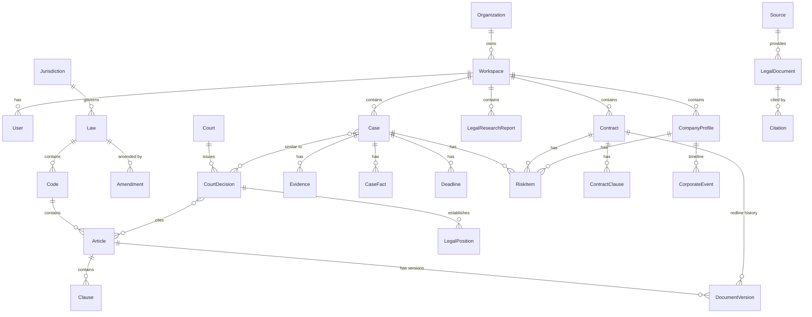

# LEGAL AI BUREAU — Database Architecture

Postgres 16 + pgvector, SQLAlchemy 2.0 async + Alembic — same as `jarvis`'s existing `pgvector/pgvector:pg16` image, so infra ops (backups, connection pooling) reuse existing playbooks.

> **Phase 2 revision note (Legal Knowledge Infrastructure):** three additions, no breaking changes to Phase 1/Task 10 tables. (1) `LegalSource` (called `Source` in the original §2 sketch — the actual model class is `LegalSource`, see [LEGAL-SOURCES.md](LEGAL-SOURCES.md)) gains lifecycle fields: `provider`, `is_official`, `is_mock`, `license_terms_url`, `allowed_storage`, `allowed_indexing`, `allowed_derivatives`, `last_sync_at`, `last_successful_sync_at`, `last_error`. (2) New `SourceDocument` table — the raw/normalized provenance record an ingestion run produces *before* it's promoted into a canonical `LegalDocument`/`LawVersion`; this is what answers "where did this text actually come from" (brief §5) without polluting the canonical tables with staging concerns. (3) New `EmbeddingChunk` table (was described in §2/§7 but never actually modeled) backing real pgvector search. `LawVersion` gains `hierarchy_path` (jsonb array, e.g. `["ГК РФ", "Раздел III", "Глава 22", "Статья 309"]`) and `source_document_id` — deliberately reused as the "legal chunk" unit from brief §8 rather than adding a parallel `Article`/`Clause`/`LegalChunk` entity family, since `LawVersion` already carries article/clause numbers, full text, and the temporal `[valid_from, valid_to)` window that §8's chunk example needs; a second parallel hierarchy would risk exactly the "two versions active at once" bug §10 warns against.

## 1. ER overview



## 2. Core knowledge entities (public, shared knowledge base — not tenant data)

### `Jurisdiction`
```
id, code (RU/EU/US/...), name, default_language, status
```

### `Source`
```
id, name, type (official_gov | court | tax | commercial_db | user_upload),
jurisdiction_id, base_url, license_type, license_terms_url,
requires_license (bool), sync_strategy (api|feed|manual), status
```
Backs the connector architecture in [LEGAL-SOURCES.md](LEGAL-SOURCES.md).

### `LegalDocument` (base table; `Law`, `RegulatoryAct`, `CourtDecision` extend it via `document_type` + joined subtype tables)
```
id (uuid)
title
document_type          -- law | code | regulatory_act | court_decision | interpretation | commercial_source
jurisdiction_id (fk)
source_id (fk)
source_url
publication_date
effective_date
expiration_date        -- nullable
version
status                 -- active | superseded | repealed | draft
content                -- normalized full text
metadata (jsonb)
hash                    -- content hash, for change detection on re-sync
created_at, updated_at
```

### `Law` / `Code`
```
id (fk -> LegalDocument.id)
short_name              -- "ГК РФ"
full_name
code_type                -- civil | tax | labor | criminal | administrative | ...
```

### `Article`
```
id, code_id (fk), number, title, text
effective_from, effective_to     -- temporal validity, see §Versioning
source_id, hash
```

### `Clause` (a paragraph/part within an Article — пункт/часть)
```
id, article_id (fk), number, text, effective_from, effective_to
```

### `Amendment`
```
id, law_id (fk), amending_act_title, amending_act_source_url,
effective_date, articles_affected (array of article_id), summary
```

### `DocumentVersion`
```
id, document_id (fk, polymorphic: article_id | legal_document_id),
version_label, valid_from, valid_to, content_snapshot, diff_from_previous
```

### `Interpretation`
```
id, article_id (fk, nullable), issuing_body (Supreme Court Plenum | Ministry letter | ...),
title, text, source_id, publication_date, status
```

### `LegalConcept`
```
id, jurisdiction_id, name, definition, related_articles (array of article_id),
synonyms (array), embedding (vector)
```
Used by semantic retrieval to bridge natural-language questions to formal terms.

### `Court`
```
id, name, level (supreme | cassation | appeal | first_instance),
jurisdiction_id, region
```

### `CourtDecision` (extends `LegalDocument`)
```
id (fk -> LegalDocument.id)
court_id (fk)
case_number
decision_date
parties (jsonb, anonymized per source policy)
claim_summary
decision_summary
legal_reasoning
outcome                  -- granted | denied | partial | settled
```

### `LegalPosition`
```
id, court_decision_id (fk), article_ids (array), statement,
strength (binding | persuasive | contradicted), superseded_by (fk, nullable)
```

### `Citation`
```
id, source_document_id (fk -> LegalDocument), cited_article_id (fk, nullable),
cited_case_id (fk, nullable), quoted_fragment, verification_status (verified|unverified|broken),
last_verified_at
```
Written by the Citation Validator (see [LEGAL-RAG.md](LEGAL-RAG.md)) — never hand-authored.

### `EmbeddingChunk`
```
id, document_id (fk, polymorphic), chunk_text, chunk_index,
embedding (vector(1536)), token_count, created_at
```

## 3. Temporal legal knowledge base ("Versioning")

Every norm-bearing table (`Article`, `Clause`, `LegalPosition`) carries `effective_from` / `effective_to` (nullable = still in force). Resolution rule, applied at retrieval time (see [LEGAL-RAG.md](LEGAL-RAG.md) §Temporal Retrieval):

```sql
SELECT * FROM article
WHERE code_id = :code_id
  AND effective_from <= :event_date
  AND (effective_to IS NULL OR effective_to > :event_date);
```

`Amendment` rows let the system explain *why* a version changed ("законом №… от … внесены изменения в ст. …"), not just serve the raw text — this is what the Reasoning Pipeline needs to answer "what applied on 2025-03-12" with a citation to the amending act, not a silent lookup.

## 4. Multi-tenant / workspace entities

### `Organization`
```
id, name, billing_tier (free|starter|professional|business|bureau|enterprise), created_at
```

### `Workspace`
```
id, organization_id (fk), name,
jurisdiction (default RU), country, region, applicable_law, language (default ru),
kb_as_of_date, created_at
```

### `User`
```
id, organization_id (fk), email, name, password_hash, mfa_enabled, created_at
```

### `WorkspaceMembership`
```
id, workspace_id (fk), user_id (fk),
role (owner|admin|lawyer|paralegal|analyst|client|viewer)
```

## 5. Matter-management entities (tenant data — strictly isolated, see LEGAL-SECURITY.md)

### `Case`
```
id, workspace_id (fk), title, status (open|research|drafting|litigation|closed),
client_name, counterparty_name, matter_type, opened_at, closed_at
```

### `CaseFact`
```
id, case_id (fk), statement, category (fact|unknown|assumption),
source (user_provided|document_extracted), confidence, extracted_at
```
Direct backing for the Fact Extraction stage (brief §9) — "Факт / Неизвестно" split is a first-class column, not prose parsing at answer time.

### `Evidence`
```
id, case_id (fk), claim_supported, evidence_type, document_id (fk, nullable),
availability (available|missing), strength (low|medium|high)
```
Backs the Evidence Matrix (brief §21).

### `Deadline`
```
id, case_id (fk, nullable), contract_id (fk, nullable), workspace_id (fk),
deadline_type (contractual|claim_period|procedural|limitation_period|hearing|notice|corporate),
due_date, computed_basis (jsonb: which norm/rule/contract clause produced this date),
status (upcoming|due|missed|completed), notify_at
```
`computed_basis` is mandatory — the Deadline Engine (brief §34) must never compute "by eye"; every date traces to a norm or contract clause.

### `RiskItem`
```
id, workspace_id (fk), subject_type (contract|case|company), subject_id,
clause_reference, severity (low|medium|high|critical), probability, impact,
category, explanation, mitigation, source_citation_id (fk, nullable)
```
Backs both the Contract Risk display (brief §14) and the general Risk Matrix (brief §22).

### `Contract`
```
id, workspace_id (fk), title, parties (jsonb), contract_type, uploaded_document_id (fk),
overall_score (0-100), status (draft|under_review|signed|terminated)
```

### `ContractClause`
```
id, contract_id (fk), clause_number, text, category
(parties|subject|obligations|term|payment|liability|termination|ip|confidentiality|jurisdiction|other),
risk_item_id (fk, nullable), recommended_redline (text, nullable)
```

### `CompanyProfile` (Due Diligence target)
```
id, workspace_id (fk), name, inn, ogrn, director, founders (jsonb), status,
registration_date, legal_risk_score (0-100)
```

### `CorporateEvent` (timeline)
```
id, company_profile_id (fk), event_date, event_type
(registration|director_change|litigation|bankruptcy_filing|ownership_change|license_change),
description, source_citation_id (fk, nullable)
```

### `LegalResearchReport`
```
id, workspace_id (fk), question, executive_summary, facts (jsonb), legal_issues (jsonb),
applicable_law_ids (array), case_law_ids (array), analysis, counterarguments,
risks (jsonb), recommendation, confidence, sources (jsonb), created_by, created_at
```

### `GeneratedDocument`
```
id, workspace_id (fk), document_type, title, content, format (md|docx|pdf),
based_on_template, review_status (drafted|reviewed|risk_checked|final), created_at
```

## 6. Audit log (section 38 — mandatory, not optional)

### `AuditLogEntry`
```
id, organization_id, workspace_id, user_id, action, target_type, target_id,
ai_model_used, prompt_version, sources_used (array of citation_id),
result_summary, ip_address, created_at
```
Written by a single interceptor at the API/agent-execution boundary — individual agents never write their own audit rows, so coverage can't be forgotten per-agent.

## 7. Indexing notes

- `EmbeddingChunk.embedding` — `ivfflat` or `hnsw` index (pgvector), one per jurisdiction to keep index size and recall reasonable as the RU corpus grows.
- `Article(code_id, effective_from, effective_to)` — btree, supports the temporal resolution query directly.
- Full-text (`tsvector`) index on `LegalDocument.content` and `CourtDecision.legal_reasoning` for the BM25 leg of hybrid retrieval (Postgres `ts_rank` or external BM25 via the search service, see [LEGAL-RAG.md](LEGAL-RAG.md)).
- All tenant tables indexed on `workspace_id` first — every query is workspace-scoped, enforced at the ORM layer (see [LEGAL-SECURITY.md](LEGAL-SECURITY.md) §Tenant Isolation), not just by convention.

## 8. Phase 6 revision note

`EmbeddingChunk` gained `embedding_provider`, `embedding_model_version`, and a persisted `embedding_namespace` (`f"{provider}:{model}:{dimensions}"`, indexed) — migrations `0006_embedding_versioning` and `0007_embedding_namespace`. `LegalChunkIndexer`'s upsert-on-reindex is now scoped to the target namespace only, never deleting another namespace's rows, so a reindex into a new embedding model is rollback-safe by construction. `LegalSource` gained `is_licensed` (Phase 5). The pgvector column itself is still fixed-dimension at migration time (`EMBEDDING_DIMENSION`) — switching to a different dimension count still requires a new column/migration, namespace isolation only solves the *comparison* half of the problem, not the storage half.

## 9. Phase 6.5 revision note — migration `0002`'s downgrade never actually ran until this audit

A full fresh-database `upgrade head` → `downgrade base` → `upgrade head` cycle (Phase 6.5 brief §15) caught a real bug: `migrations/versions/0002_legal_knowledge_infrastructure.py`'s `downgrade()` called `op.drop_constraint("ex_law_versions_no_overlap", "law_versions", type_="exclude")` — but alembic's `drop_constraint` only accepts `'check'/'foreignkey'/'primary'/'unique'/None` for `type_`, not `'exclude'` (Postgres `EXCLUDE USING gist` constraints have no first-class alembic op). This has presumably been broken since Phase 2; it was never exercised because every environment so far only ever ran `upgrade head` forward. Fixed to raw SQL (`ALTER TABLE law_versions DROP CONSTRAINT ex_law_versions_no_overlap`), matching how the constraint was created. The full cycle now passes cleanly on a real Postgres instance — verified this session, not merely asserted.

## 10. Phase 9.2 revision note — Document Intelligence (migration `0009_document_intelligence`)

`Document` (§5) gained real pipeline fields: `original_filename`, `media_type`, `size_bytes`, `sha256` (indexed, used for intra-workspace dedup), `status` (`DocumentStatus`: `uploaded`/`processing`/`ready`/`failed`/`ocr_required`/`unsupported`), `processing_error`, `processed_at`. `extracted_text` and `doc_metadata` (both already existing columns from earlier phases) are now actually populated.

New table `document_chunks` — the tenant-document mirror of the public-KB `embedding_chunks` (§2), and deliberately a **separate table**, not a reuse of `EmbeddingChunk` with an added `workspace_id`: `EmbeddingChunk` has no `workspace_id` column at all, which is what makes cross-tenant leakage of the public Legal Knowledge Base structurally impossible (§2, the `test_public_legal_kb_has_no_workspace_column` test). Adding tenant data into that same table would have broken that invariant. `document_chunks` columns: `workspace_id` (NOT NULL FK), `document_id` (FK, `ondelete="CASCADE"`), `chunk_index`, `page_number`, `section_path`, `text`, `content_hash`, `start_offset`/`end_offset`, `embedding`/`embedding_model`/`embedding_namespace` (same shape as `EmbeddingChunk`'s embedding columns, same namespace-isolation discipline from Phase 6). Unique constraint on `(workspace_id, document_id, chunk_index)` — reprocessing deletes-then-reinserts rather than relying on this for upsert semantics, but it still guards against a bug ever producing two chunks at the same position. Given the same permissive RLS scaffold as `documents`/`cases`/etc. (§6.5's still-open TODO from Phase 1 — not tightened this phase either).
